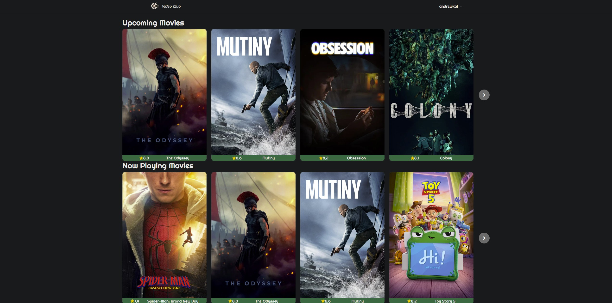
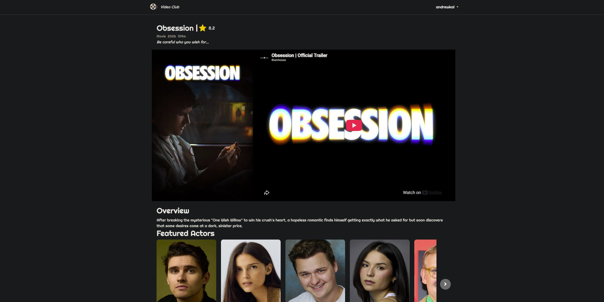

# Video Club

Video Club is a web app for browsing through a variety of movies and TV series.
Users can browse through different categories of movies and TV series. When the user selects a movie or a TV series, detailed information about that movie or TV series is displayed, such as trailers, ratings, and cast.
Movie and TV data is fetched from the TMDB API.

## Preview




## Features

- User login and session support.
- Responsive design across different screen sizes.
- Browse movies and TV series by predefined categories.
- View detailed information for each movie or TV series.
- Watch trailers.
- View ratings and cast information.

## Tech Stack

### Frontend & Templating
- HTML5
- CSS3
- JavaScript
- Bootstrap
- EJS

### Backend
- Node.js
- Express.js

### API Integration
- TMDB API
- Axios

### Authentication & Session Management
- TMDB Authentication
- express-session

## Getting Started

### Prerequisites

- Node.js
- TMDB account

### Installation

1. Clone the repository:

   ```bash
   git clone https://github.com/andreaskalo/video-club.git
   ```
2. Navigate to the project directory:
   
   ```bash
   cd video-club
   ```
3. Install the dependencies:

   ```bash
   npm install
   ```
### Environment Variables

Create a `.env` file in the root directory based on `.env.example`.

```env
TMDB_ACCESS_TOKEN=your_tmdb_access_token
SESSION_SECRET=your_session_secret
```

To get the TMDB_ACCESS_TOKEN, follow the steps below:
 - Go to: https://www.themoviedb.org/
 - Log in or create a TMDB account
 - Go to Profile & Settings and navigate to Settings
 - Go to API
 - Copy the API Read Access Token and set it as the value of TMDB_ACCESS_TOKEN

For SESSION_SECRET, use a strong random string.

### Run the Application

Start the server:

```bash
npm start
```

Then open:
`http://localhost:3000`

### Credits

This product uses the TMDB API but is not endorsed or certified by TMDB.

Movie and TV data and images are provided by The Movie Database (TMDB).
